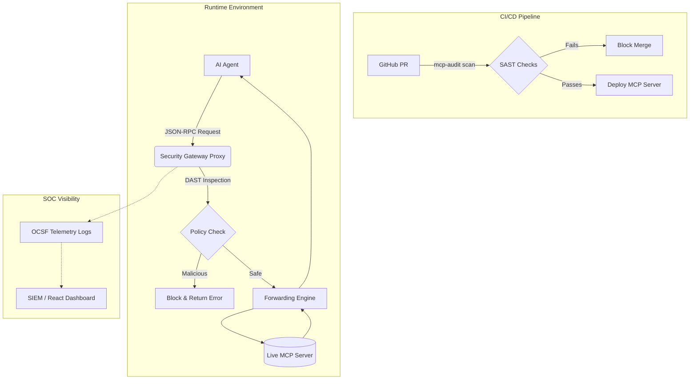

<div align="center">
  
# 🛡️ MCP-Audit
**The Enterprise Security Control Plane for AI Agents**

[](https://badge.fury.io/py/mcp-audit)
[](https://opensource.org/licenses/MIT)
[](https://www.python.org/downloads/)
[](https://www.docker.com/)

[Features](#-core-features) • [Quick Start](#-quick-start) • [Architecture](#-architecture-overview) • [Integration](#-developer-integration) • [Dashboard](#-enterprise-dashboard)

</div>

---

As AI agents gain autonomous access to local filesystems, production databases, and sensitive APIs via the [Model Context Protocol (MCP)](https://modelcontextprotocol.io), security becomes paramount. **MCP-Audit** is the industry's first comprehensive security firewall and static analysis tool for MCP. 

We provide a complete "Shift-Left to Runtime" pipeline that ensures your AI agents only perform strictly authorized actions—protecting your infrastructure from prompt injections, command execution exploits, and runaway agents.

---

## ⚡ Core Features

<details>
<summary><b>1. Static Analysis (SAST) CI/CD Engine</b></summary>
<br/>
Catch vulnerabilities <i>before</i> they are deployed. The CLI parses <code>mcp.json</code> schemas in your repository to detect:

- **Arbitrary Code Execution:** Detects dangerous tools like `bash_eval` or `python_exec`.
- **Path Traversal & Schema Bombs:** Identifies unrestricted file system access (e.g. `read_file` without sandboxing).
- **Prompt Injection Risks:** Uses heuristics to flag tools vulnerable to malicious system prompts.
</details>

<details>
<summary><b>2. Runtime Security Gateway (DAST Proxy)</b></summary>
<br/>
Don't trust the LLM. The Security Gateway sits invisibly between your AI Agent and your MCP Server.

- **Dynamic Payload Inspection:** Intercepts JSON-RPC traffic.
- **Command Injection Blocking:** Blocks malicious parameters injected by hallucinating or hijacked agents.
- **Transparent Forwarding:** Natively forwards cleared requests to your downstream servers via the `ForwardingEngine`.
</details>

<details>
<summary><b>3. Enterprise Control Plane & Telemetry</b></summary>
<br/>
Security Operations Centers (SOC) cannot manage what they cannot see.

- **Structured Telemetry:** Automatically formats all allowed/blocked requests into **OCSF** JSON logs, ready for SIEM ingestion (Splunk, Datadog).
- **FastAPI & PostgreSQL Backend:** Tracks multi-tenant risk metrics and historical vulnerability scores.
</details>

---

## 🏗 Architecture Overview



---

## 🚀 Quick Start

### For Developers (CLI)
Install the python package to use the static scanner immediately.

```bash
# Install via pip
pip install mcp-audit

# Scan your local MCP schema directory
mcp-audit scan ./path/to/mcp-servers/
```

### For Platform Engineers (Docker Backend)
Spin up the complete Enterprise Control Plane, including the Postgres database, FastAPI backend, and React Dashboard.

```bash
# Clone the repository
git clone https://github.com/shivasync0/MCP-Audit.git
cd MCP-Audit

# 1. Start the Backend Infrastructure
docker-compose up --build -d

# 2. Start the React Frontend Dashboard
cd dashboard
npm install
npm run dev
```
Navigate to **`http://localhost:5173`** to view the live dashboard!

---

## 💻 Developer Integration

Integrating MCP-Audit into your existing workflows is designed to be completely frictionless.

### CI/CD Pipeline (GitHub Actions)
Add our CLI to your GitHub Actions to automatically reject vulnerable MCP tools.

```yaml
name: MCP Security Scan
on: [push, pull_request]

jobs:
  audit:
    runs-on: ubuntu-latest
    steps:
      - uses: actions/checkout@v3
      - run: pip install mcp-audit
      - run: mcp-audit scan ./mcp-servers/
```

### Python Gateway Wrap
Programmatically instantiate the Gateway Proxy to wrap your existing MCP Server deployments in Python.

```python
from mcp_audit.gateway import SecurityGatewayProxy
from mcp_audit.gateway.forwarder import ForwardingEngine

proxy = SecurityGatewayProxy()
forwarder = ForwardingEngine("npx @modelcontextprotocol/server-postgres")

# Intercept and forward RPC requests natively
async def handle_request(rpc_req):
    if proxy.evaluate_request(rpc_req):
        return await forwarder.forward_request(rpc_req)
```

---

## 🎨 Enterprise Dashboard

The React Dashboard and marketing site (`website.html`) are custom-styled using the unique **Meridian Vintage** design system (Pale Sage & Dark Green Ink) providing a premium, unified brand experience to your security team. It features:
- Live Gateway Interception Volumes
- Interactive Risk Category Analysis
- Open Findings Remediation workflows

---

## 🤝 Contributing
We welcome contributions! Please open an issue or submit a Pull Request if you'd like to help expand the rule engines or build new SIEM integrations.

## 📄 License
This project is licensed under the MIT License - see the [LICENSE](LICENSE) file for details.

<div align="center">
  <i>Built to secure the autonomous future.</i>
</div>
